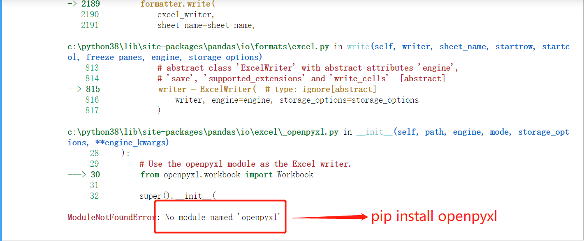

1、创建1000条语、数、外、Python的考试成绩DataFrame，范围是0~150包含150，分别将数据保存到csv文件以及Excel文件，保存时不保存行索引。

提示：（说明没有这个库，安装一下，如果不出错，说明你的电脑上有这个库，直接过滤就行）

2、创建使用字典创建DataFrame，行索引是a~z，列索引是：身高（160-185）、体重（50-90）、学历（无、本科、硕士、博士）。身高、体重数据使用NumPy随机数生成，学历数据先创建数组edu = np.array(['无','本科','硕士','博士'])，然后使用花式索引从四个数据中选择26个数据。

3、使用题目二中的数据，进行数据筛选。

* 1、筛选索引大于 **'t'** 的所有数据
* 2、筛选学历是博士，身高大于170或者体重小于80的学生

4、使用题目二中数据，开始学生们开始减肥

* 本科生减肥，减掉的体重统一是10
* 博士生减肥，减掉体重范围是5~10

