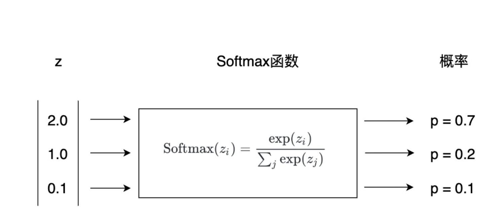

# 作业

1、给定一个4维矩阵，如何得到最后两维的和？（提示，指定axis进行计算）

2、给定数组[1, 2, 3, 4, 5]，如何得到在这个数组的每个元素之间插入3个0后的新数组？

3、给定一个二维矩阵（5行4列），如何交换其中两行的元素（提示：任意调整，花式索引）？

4、创建一个100000长度的随机数组，使用两种方法对其求三次方（1、for循环；2、NumPy自带方法），并比较所用时间

5、创建一个5行3列随机矩阵和一个3行2列随机矩阵，求矩阵积

6、矩阵的每一行的元素都减去该行的平均值（注意，平均值计算时指定axis，以及减法操作时形状改变）

7、打印出以下函数（要求使用np.zeros创建8*8的矩阵）：

```
 [[0 1 0 1 0 1 0 1]
  [1 0 1 0 1 0 1 0]
  [0 1 0 1 0 1 0 1]
  [1 0 1 0 1 0 1 0]
  [0 1 0 1 0 1 0 1]
  [1 0 1 0 1 0 1 0]
  [0 1 0 1 0 1 0 1]
  [1 0 1 0 1 0 1 0]]
```

8、正则化一个5行5列的随机矩阵（数据统一变成0~1之间的数字，相当于进行缩小）
正则的概念：矩阵A中的每一列减去这一列最小值，除以每一列的最大值减去每一列的最小值（提示：轴axis给合适的参数！！！）

<font size = 6 >$\rm{ A = \frac{A - A.min}{A.max - A.min}}$</font>


9、如何根据两个或多个条件过滤numpy数组。加载鸢尾花数据，根据第一列小于5.0并且第三列大于1.5作为条件，进行数据筛选。（提示，需要使用逻辑与运算：&）


10、计算鸢尾花数据**每一行**的softmax得分（exp表示自然底数e的幂运算）




