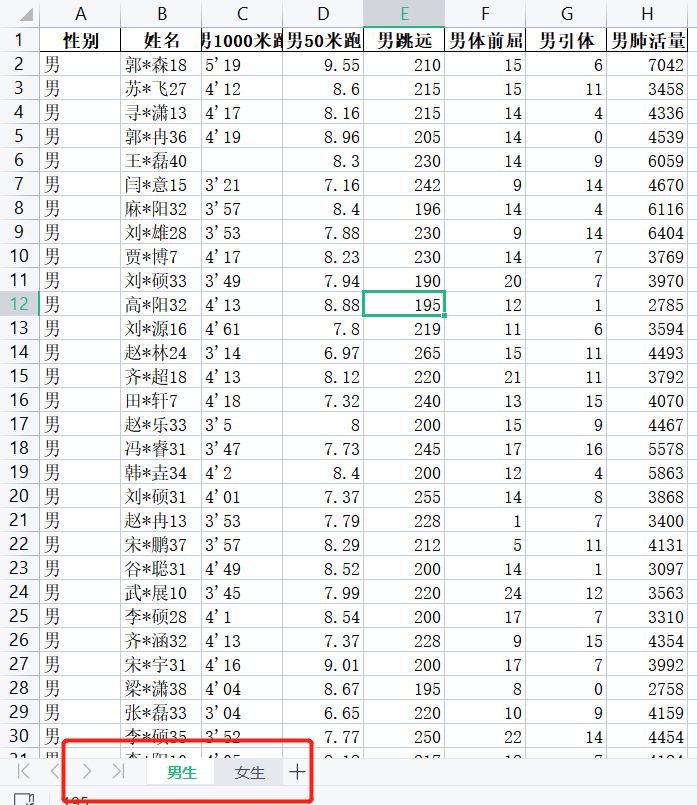
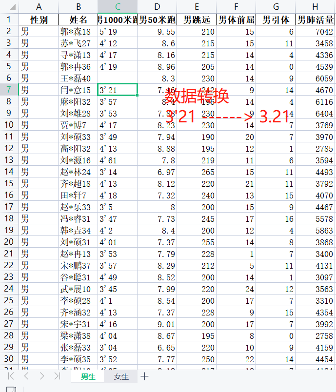
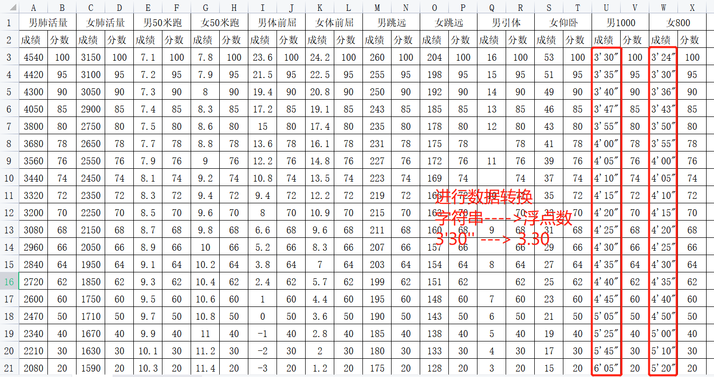
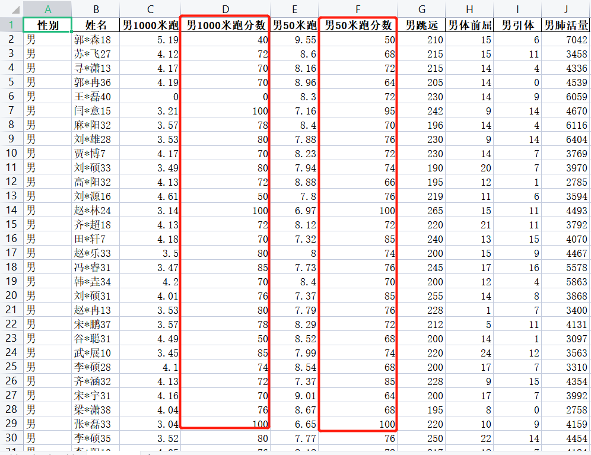

### 体测成绩转换

1、学生体侧成绩原始数据介绍（既有男生，也有女生数据）

里面有空数据，说明这名学生没有参加这项体侧，将空数据填充为0

* 

* 1000米跑的数据需要转换，将4'13(字符串)转为 4.13（浮点数） 
* 

* 处理结果如下：

  

  

2、体侧评分表介绍

将男女生跑步成绩，进行转换3‘30’‘ （字符串）----> 3.3（浮点数）

* 

3、转换后结果，效果如下：

* 

### 任务要求

1、数据清洗（体侧成绩.xlsx）

* 空数据处理
* 字符串转浮点数（4’13 ------> 4.13）

2、数据清洗（体侧成绩评分表.xls）

* 字符串转浮点数（3‘30’‘ ---->3.30）

3、数据转换

* 男生跑步类项目根据成绩转换成分数

* 男生力量型项目（跳远、提前去）成绩转换为分数

* 全部转换好后保存到文件中

* 最终效果如下：

  

  

4、数据转换

* 女生也根据上面要求进行操作

5、所用到知识点

* 数据转换
* 字符串拆分
* DataFrame增加一列
* 定义函数，将成绩转为分数

