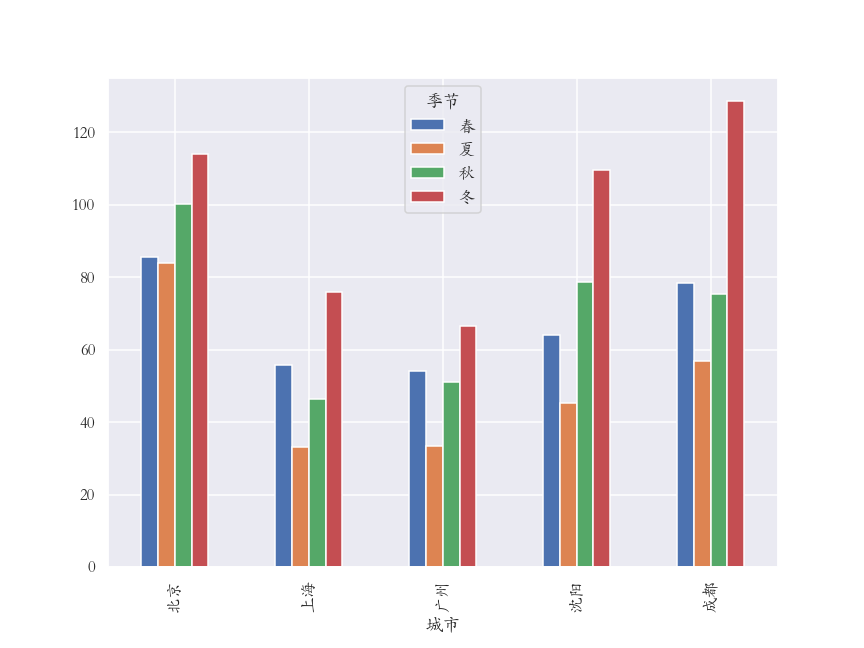

数据可视化初级

### 题目一

绘制如下图形

要求：

* 设置背景颜色为：灰色
* 设置视图颜色为：灰色
* 设置网格线颜色：白色
* 设置网格线样式：虚线
* 函数关系如下：y = np.sin(x + i * 0.5) * (7 - i)
  * 方程中的i可以给定范围1~6，表示图片中的6条线

### 题目二：

根据提供数据，进行分组聚合运算，绘制如下图形

要求：

* 分组聚合求各个城市春夏秋冬的PM2.5的平均值
* 对分组聚合结果进行数据重塑
* 调整行索引顺序按照：北京、上海、广州、沈阳、成都
* 调整列索引顺序：春夏秋冬
* 使用DataFrame方法绘制条形图

