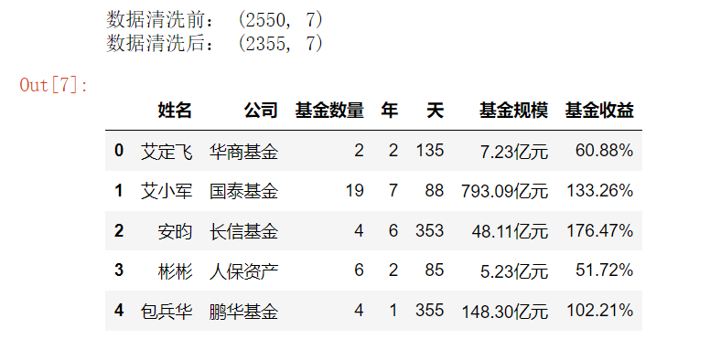

数据可视化进阶作业

对基金数据进行处理，对处理后的数据，进行数据可视化，展示最大的十大基金公司；并展示收益十佳基金经理。

### 数据处理

#### 数据查看

加载数据，并查看相关信息：

#### 数据清洗

将**基金规模**小于1亿元的数据过滤掉，将**基金收益**没有数据的过滤掉。

过滤之后效果如下：

#### 数据转换

将基金规模和基金收益转换为浮点数，并将处理好的数据保存。效果如下：

### 数据挖掘与可视化

#### 十大基金公司

根据基金总规模，进行排序，水平条形图展示前十大公司

#### 收益十佳基金经理

根据收益率，对所有数据进行降序排名，绘制前十佳基金经理。并将金额和收益率绘制到图片中。

